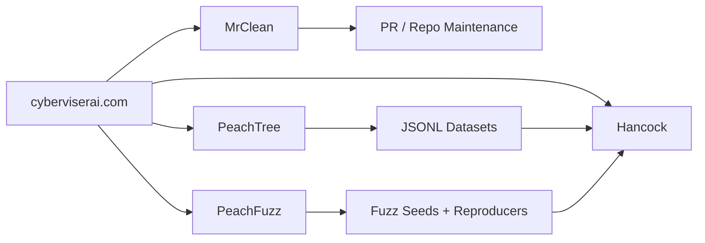

# Johnny Watters / 0AI / CyberViser

  

  <strong><a href="https://cyberviserai.com/">cyberviserai.com</a></strong>
  · <a href="https://0ai-cyberviser.github.io/0ai/">0AI Pages</a>
  · <a href="https://cyberviser.github.io/Hancock/">Hancock Pages</a>
  · <a href="https://github.com/0ai-Cyberviser">GitHub</a>

`0ai-Cyberviser` is the primary GitHub profile for Johnny Watters and the public engineering identity for CyberViser / 0AI.

The mission is to build a connected, ethical, open-source cybersecurity automation ecosystem around AI agents, fuzzing, dataset generation, vulnerability intelligence, SOC/IR workflows, and GitHub maintenance automation.

## Core stack

| Project | Role | Link |
|---|---|---|
| CyberViser AI | Public hub tying the ecosystem together | https://cyberviserai.com/ |
| Hancock | AI cybersecurity agent for pentest, SOC, Sigma, YARA, IOC, OSINT, code, CISO, and fuzzing workflows | https://github.com/0ai-Cyberviser/Hancock |
| PeachFuzz | Fuzzing engine for harnesses, crash minimization, reproducers, and parser corpora | https://github.com/0ai-Cyberviser/peachfuzz |
| PeachTree | Recursive learning-tree dataset engine for safe, traceable JSONL datasets | https://github.com/0ai-Cyberviser/PeachTree |
| MrClean | Policy-first GitHub PR/repo maintenance agent | https://github.com/0ai-Cyberviser/mrclean |
| 0AI | Broader project coordination and portfolio surface | https://github.com/0ai-Cyberviser/0ai |
| CyberViser-ViserHub | Source repo for the CyberViser AI public site | https://github.com/0ai-Cyberviser/CyberViser-ViserHub |

## Free-first operating model

The current build path is intentionally low-cost:

- GitHub Pages for public websites
- GitHub Actions for CI and deployment where available
- Pull requests for reviewable improvements
- Issues for roadmap tracking
- Local machines for dataset and fuzzing workflows
- No paid GPU dependency for the repo/site polish phase

## How the projects connect

## Repository polish standard

Every core repo should aim for:

- clear mission statement
- badges and status links
- quick start
- architecture or workflow diagram
- safety / ethics boundary
- related project links
- roadmap
- link back to `https://cyberviserai.com/`

## Account structure

- [0ai-Cyberviser](https://github.com/0ai-Cyberviser): primary engineering and portfolio account
- [cyberviser](https://github.com/cyberviser): CyberViser brand and project publishing account
- [cyberviser-dotcom](https://github.com/cyberviser-dotcom): public fork and distribution account

## Ownership and license policy

- Original 0AI / CyberViser projects are maintained under their repository-specific license terms and control notices.
- Forked repositories remain subject to their upstream licenses.
- Ownership claims in forked repositories apply only to fork-specific modifications, branding, metadata, notices, and new original material lawfully controlled by Johnny Watters.

## Contact

- 0ai@cyberviserai.com
- cyberviser@proton.me

Operated by Johnny Watters (`0ai-Cyberviser`) under CyberViser / 0AI.
